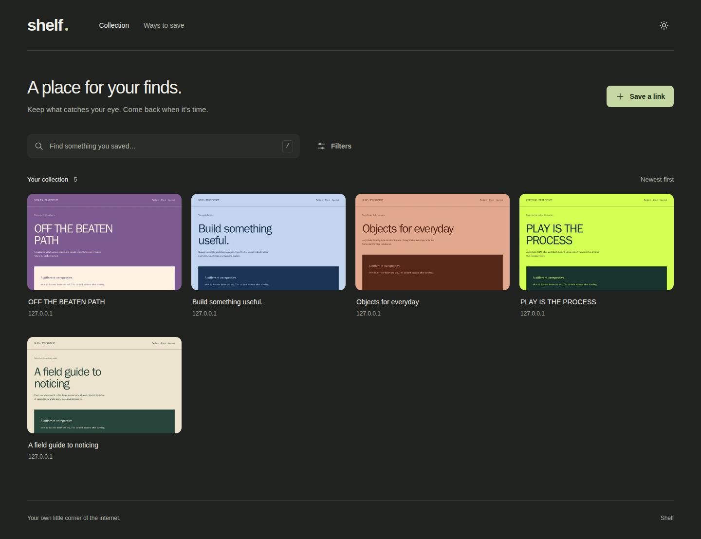

# Shelf

A small, self-hosted place for links worth keeping. Save a URL, keep a screenshot and a readable article, add a reminder, and find it again through your collection or search. YouTube links open in an embedded player.



## Run with Docker

Requires Docker with Compose v2.24 or later. The app runs on Node 22 and uses the official Playwright image with its matching Chromium version.

```sh
cp .env.example .env
mkdir -p data
# Set SHELF_UID and SHELF_GID in .env to the output of id -u and id -g.
docker compose up -d --build
```

Open **http://localhost:3080**, or `http://<server-lan-or-tailscale-address>:3080` from another device. The `data` directory must be writable by the configured UID/GID (both default to 1000). No other services are required.

```sh
docker compose logs -f shelf
curl http://localhost:3080/api/health
docker compose stop
```

There is deliberately no login. Keep Shelf on your LAN/tailnet and do not expose port 3080 to the public internet. `tailscale serve` can provide HTTPS on your tailnet if your Shortcut or clipboard access needs HTTPS.

## First milestone

- Immediate, persistent URL saving and normalised URL deduplication.
- Two concurrent Chromium captures, retries, a viewport preview and a full-page screenshot capped at 16,000px.
- A responsive collection with JS masonry placement, light/dark themes, cursor pagination and live updates.
- Screenshot detail views, editable notes, manual tags, favourites, archive, recapture and delete.
- Text search across titles, descriptions, domains, extracted page text, notes and tags.
- Technology, platform and colour-mood tags, plus a five-colour quantised palette.
- Optional vision-model tagging (OpenAI-compatible or Anthropic) that never blocks the preview.
- Bookmarklet, Shortcut instructions, and an API suitable for Hermes.

Semantic search, richer covers, rediscovery and Raindrop import/sync are **not implemented yet**. Raindrop environment variables are reserved. Palette extraction is a simple quantiser.

## Read it later

Save an article using the same URL box, bookmarklet, or API. Shelf automatically extracts a reading copy with [Mozilla Readability](https://github.com/mozilla/readability), alongside the screenshots. Articles open in **Read**; **Full page** and **First screen** keep the original visual reference available.

The reader keeps headings, paragraphs, lists, quotes, links, tables and code, with comfortable typography in both themes. It shows an estimated reading time and lets you **Mark as read** or **Mark unread**. Your reading position saves automatically to Shelf, with a browser-local fallback when a save fails. Search covers the complete extracted article, including text beyond the old 5,000-character preview.

Reading copies live in your SQLite database and remain available if the original page disappears, as long as you can reach your Shelf server. This is not a browser-offline mode. Images, scripts, embedded media and the site's styling are omitted. Extraction is best-effort: paywalls, login-only content, bot protection and unusual layouts can prevent a useful copy. Very large pages (over 5 million HTML characters, 50,000 elements, or 2 million extracted text characters) are skipped. If extraction finds no article, screenshots remain available. A failed extraction during recapture keeps any previous reading copy.

**Existing bookmarks:** open one and choose **Recapture** to add its reading copy. New database columns are migrated automatically on startup; existing bookmarks are not recaptured in bulk. To update a Docker installation:

```sh
docker compose up -d --build
```

## Watch YouTube links

Save a YouTube video URL as usual. Standard watch links, `youtu.be` links, Shorts, live-video links and embed links open in **Watch**, even if screenshot capture fails. Shared start times are preserved. Press **Play video** to load the player; Shelf uses YouTube's privacy-enhanced embed domain and does not load the player before that click.

Playback needs an internet connection and remains subject to YouTube's availability and embedding restrictions. **Watch on YouTube** opens the original when embedded playback is unavailable. Shelf does not download videos, save transcripts or track playback position. Channel pages and playlist-only links remain ordinary bookmarks.

## Saving from a browser

Open **Ways to save** (`/settings`) and drag **Save to Shelf** to your bookmarks bar. Click it on any page to save that page's URL. The small popup confirms the save while capture continues in the background. Open settings using the hostname you normally use, because the bookmarklet includes that origin. Browser popup/content-security restrictions may prevent it working on some pages; use the main URL form in that case.

## Hermes and other agents

Hermes only needs HTTP access to Shelf. It can use the same intake endpoint as the web UI:

```sh
curl --fail-with-body -X POST 'http://<shelf-host>:3080/api/items' \
  -H 'Content-Type: application/json' \
  -d '{
    "url": "https://example.com/interesting-page",
    "note": "Try this for the next project",
    "tags": ["reference", "tools"],
    "source": "hermes"
  }'
```

Only `url` is required. Notes are optional strings, tags are an optional array of strings, and `source` defaults to `web`.

- **201**: the bookmark is safely stored and capture is queued.
- **200** with `duplicate: true`: that normalised URL already exists; the response contains the existing bookmark. A duplicate save leaves existing notes/tags unchanged.
- **400**: invalid input. URLs must use HTTP(S) and cannot contain credentials.
- Network failure: retry the same request; known normalised URLs are deduplicated.

The response is the bookmark object, including `id`, `status`, `url`, `note`, `tags`, and `duplicate`. To check the preview later, use `GET /api/items/<id>`. A capture failure does not undo a successful save. `POST /api/items/<id>/recapture` queues another attempt.

A suitable instruction for Hermes:

> When I ask you to save a URL to Shelf, POST it to `<SHELF_BASE_URL>/api/items` as JSON with `url` and `source: "hermes"`. Include a note or tags when I supply them. A 201 means saved; a 200 with `duplicate: true` means already saved. Tell me the save result without waiting for a screenshot. Never claim a save succeeded after a request error.

This project does not change Hermes configuration or assume which Hermes runtime you use. The integration boundary is this HTTP contract. No API key is needed on your private network.

## Apple share-sheet Shortcut

1. Create a Shortcut called **Save to Shelf** and enable **Show in Share Sheet**, receiving URLs.
2. Add **Get URLs from Input**.
3. Add **Repeat with Each** URL if you want to support sharing several links.
4. Inside the repeat block, add **Get Contents of URL** with `http://<shelf-host>:3080/api/items`, method **POST**, and request body **JSON**.
5. Add a text field named `url` whose value is the current URL (Repeat Item), and a text field named `source` with value `shortcut`.
6. Optionally read the returned `id` and show a **Saved to Shelf** notification after a successful response. Keep errors visible so a disconnected server does not look like a successful save.

Enable Tailscale on your phone when away from home. Use your tailnet HTTPS address if your device requires HTTPS.

## API

| Method | Path | Purpose |
| --- | --- | --- |
| POST | `/api/items` | Save `{url, note?, tags?, source?}` |
| GET | `/api/items?q=&tag=&domain=&favourite=&archived=&cursor=&limit=` | Search and paginate; returns `{items, next_cursor, total}` |
| GET | `/api/items/:id` | Fetch a bookmark |
| PATCH | `/api/items/:id` | Edit `{note?, favourite?, archived?, add_tags?, remove_tags?}` |
| POST | `/api/items/:id/recapture` | Queue a new capture, retaining the old images until success |
| POST | `/api/items/:id/cover` | Replace the screenshot with a PNG/JPEG/WebP/GIF body (paste from the detail view) |
| DELETE | `/api/items/:id` | Delete bookmark and screenshots; a running capture returns 409 |
| GET | `/api/tags` | Tags and bookmark counts |
| GET | `/api/events` | SSE `change` events; clients refresh their current query |
| GET | `/api/health` | Database, browser and queue health |

`favourite=true` and `archived=true` are literal query strings. Archived items are excluded by default. Search treats words as literal prefix terms combined with AND, rather than accepting raw FTS syntax. Cursor values are opaque. Page size defaults to 40 and is capped at 100. Request bodies are limited to 32 KiB. The API is same-origin for browser writes; server-side agents can call it directly.

## Capture behaviour and limitations

One Chromium browser stays open; every job gets a fresh context. Consent/chat scripts are blocked using `server/capture-rules.ts`. The worker waits for load, allows a short network-idle grace period, captures the first screen, scrolls to trigger lazy content, and captures up to the configured maximum height. Failed jobs retry twice with backoff. Every attempt has a hard deadline and logs its outcome and duration to stdout.

Recapture writes new filenames. A failed refresh preserves the last successful images. Older captures are retained until the bookmark is deleted, so a frequently recaptured library will grow on disk.

Normalisation strips fragments and known tracking parameters but preserves meaningful query strings. Same-host canonical declarations are recorded as aliases after capture. Separately saved URLs that only later turn out to redirect to the same page are not automatically merged in this milestone; no notes or IDs are silently discarded.

Some sites block headless browsers or need a login. The URL remains saved and searchable when its preview fails. Capture does not retain browser cookies or archive runnable HTML. Layout repair is opt-in because forcing animation visibility can alter a site's appearance.

## Configuration

Every variable is documented in `.env.example`.

| Variable | Default | Behaviour |
| --- | --- | --- |
| `SHELF_UID`, `SHELF_GID` | `1000` | Container user/group owning the data mount |
| `CAPTURE_CONCURRENCY` | `2` | Simultaneous captures, clamped to 1–8 |
| `MAX_FULLPAGE_HEIGHT` | `16000` | Screenshot height cap, clamped to 900–25000 |
| `CAPTURE_REPAIR` | `false` | Repair hidden reveal elements and repeated fixed positioning |
| `TAGGER_PROVIDER` | `none` | `openai-compatible`, `anthropic`, or `none`. Heuristic tags always run |
| `TAGGER_BASE_URL`, `TAGGER_API_KEY`, `TAGGER_MODEL` | empty | Vision model endpoint, secret and model name |
| `RAINDROP_TOKEN`, `RAINDROP_COLLECTION_ID` | empty | Reserved for Raindrop integration |
| `RAINDROP_SYNC_MINUTES` | `30` | Reserved for Raindrop integration |

Outside Docker, `DATA_DIR` defaults to `./data` and `PORT` to `3000`. Docker sets them to `/data` and `3000`. The compose host port is `3080`.

## Back up and restore

The SQLite database, WAL files and screenshots live together in `data/`. For a consistent simple backup:

```sh
docker compose stop shelf
tar -czf shelf-backup.tar.gz data .env
docker compose start shelf
```

Treat backups as private: they contain saved page text, images, notes and any environment secrets. Restore into an empty deployment directory with the app stopped, unpack the archive, ensure `data` has the configured UID/GID, then start Shelf. Do not unpack over a running database. Keep `shelf-backup.tar.gz` outside the repository and avoid overwriting your only backup.

## Development and checks

```sh
npm ci
npm run build
npm test
```

Use Node 22. `npm start` serves the built app and requires Chromium installed for the pinned Playwright version (`npx playwright install chromium` outside Docker). For frontend iteration, run the server on port 3000 and `npm run dev` in another terminal; Vite proxies API and screenshot requests to it.

The Docker image includes the tools needed to run the isolated capture and UI smoke test:

```sh
docker compose build
docker compose run --rm --no-deps shelf node --test dist/tests/core.test.js
docker compose run --rm --no-deps -e REVIEW_DIR=/tmp/shelf-review shelf npm run test:smoke
docker compose run --rm --no-deps -e REVIEW_DIR=/tmp/shelf-review shelf node dist/tests/reader.js
```

The smoke test uses a temporary database and five **synthetic** local fixtures: static blog, scroll-reveal portfolio, storefront, long docs page and consent overlay. It checks real screenshot dimensions, clipping, live updates, notes, search, mobile overflow, bookmarklet dedupe and immutable recapture. It never inserts fixtures into your personal collection. Screenshots in its output directory are test evidence, not preloaded bookmarks.

The reader browser test covers long-article extraction, safe formatting, full-text search, read status, position restoration, responsive themes, screenshot fallback, YouTube embed activation and the favicon. It uses local fixtures and a mocked YouTube player; it does not assert that a particular public video is playable.

Model-response parser and heuristic-tag tests run with `npm test`. Set `TAGGER_PROVIDER=none` to keep captures on heuristic tags only.

See [the first milestone acceptance notes](docs/acceptance.md) for results and observed capture limitations.

## Licence

Shelf is available under the [MIT licence](LICENSE).
